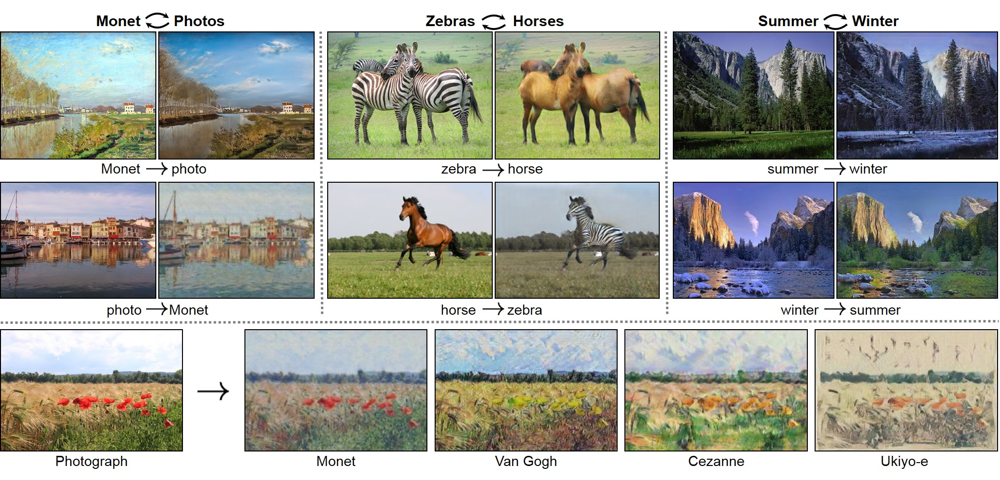

### Cycle Generative Adversarial Network (CycleGAN)

CycleGAN is an image-to-image translation algorithm in the domain of Generative AI. It works by learning the mapping between two different image domains, such as photographs and sketches, using unpaired dataset.

    
     
    <em>Domain translation with CycleGAN.</em>

Here, a CycleGAN have been developed from scratch for image-to-image translation of horses to zebras and vice versa.

    
     
    <em>Samples of horse and zebra data.</em>

Some example of one domain (horse images) can be seen on the upper row, while some images of the other domain is shown in the lower row. A sample output after a try to train the model is as follow:  

    
     
    <em>Horse to zebra translation.</em>

